# 🧾 Portfólio de Atividades Extracurriculares

Este repositório reúne registros das palestras e atividades de contextualização profissional realizadas ao longo da minha formação acadêmica. O objetivo é documentar as experiências e destacar as competências desenvolvidas em cada atividade.

---

## 🎤 Palestra: Apresentação do Cronograma de Atividades do PTech
**Data:** 18/04/2023

Nesta palestra, as empresas parceiras do programa **PTech** apresentaram o cronograma anual de atividades e encontros previstos para o ano letivo.

Durante o encontro, foram discutidas:
- As principais metas do programa.
- As atividades propostas.
- A forma como esses eventos contribuiriam para as **Atividades de Contextualização Profissional (ACP)**.

A apresentação nos orientou sobre oportunidades de aprendizado prático e o desenvolvimento de competências essenciais para a **inserção no mercado de trabalho**.

---

## 💻 Palestra Remota: Dia a Dia do Analista de Suporte
**Data:** 27/04/2023

Nesta palestra remota, nós conhecemos as rotinas e desafios enfrentados por um analista de suporte no ambiente corporativo.

O palestrante abordou:
- As habilidades técnicas e interpessoais essenciais para atuar nessa função.
- O uso de ferramentas e práticas de resolução de problemas que agilizam o atendimento ao cliente e a manutenção dos sistemas.

A palestra também trouxe exemplos práticos de situações comuns no cotidiano desse profissional, oferecendo uma visão realista e motivadora sobre a carreira em suporte técnico.

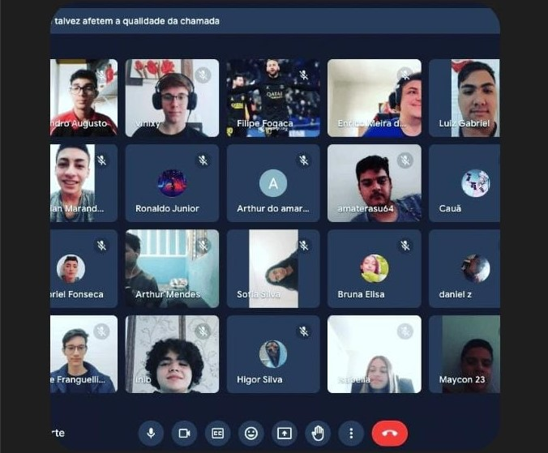

---

## 🎤 Palestra: Boas-Vindas da ITIX com o Sócio Proprietário Carlos Santos
**Data:** 04/05/2023

Durante a Semana Paulo Freire, nós participamos de uma palestra de boas-vindas com Carlos Santos, sócio proprietário da ITIX.
A apresentação incluiu uma introdução à empresa, sua área de atuação e os valores que guiam o trabalho da equipe.
Carlos compartilhou sua experiência no mercado de tecnologia e destacou as competências que a empresa valoriza em novos profissionais, além de oferecer uma visão sobre as oportunidades e desafios no setor de TI.

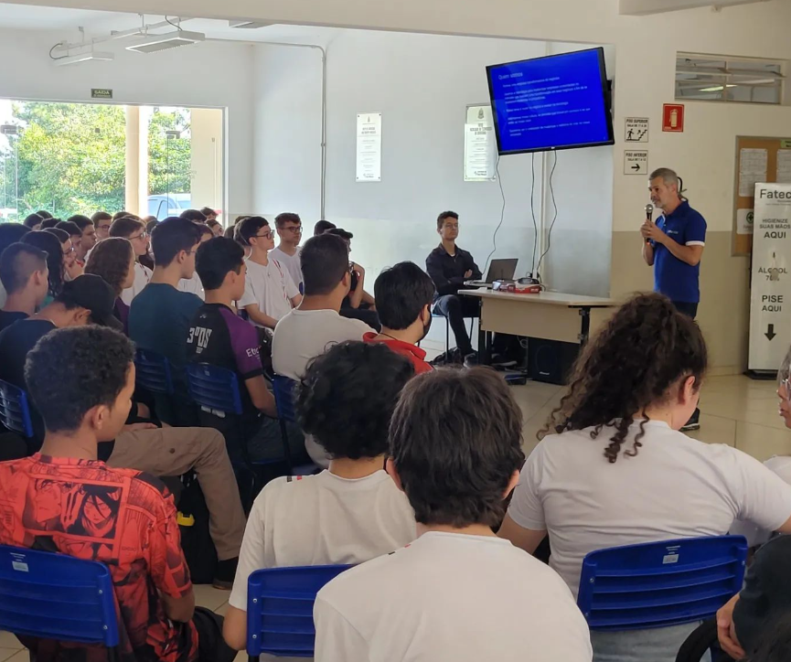

---

## 🎤 Palestra: De Estagiária a Analista de Requisitos: A Importância da Interpretação e do Relacionamento Humano – ITIX
**Data:** 05/05/2023

A palestrante Tamires Martins contou sua trajetória de estagiária até o cargo de Analista de Requisitos, enfatizando como habilidades interpessoais são fundamentais para essa área.
Além do conhecimento técnico, ela destacou a importância da interpretação de necessidades e do relacionamento com clientes e equipes.
A palestra abordou também como a capacidade de comunicação e a empatia influenciam positivamente o desenvolvimento de projetos e o ambiente de trabalho, nos motivando a desenvolver tanto habilidades sociais quanto técnicas.

---

## 💻 Palestra Remota: Ética e Valores
**Data:** 11/05/2023

Na palestra do dia 11/05, realizada de forma remota, nós participamos de uma discussão sobre ética e valores no ambiente profissional.
A apresentação abordou a importância de adotar atitudes éticas e responsáveis em situações cotidianas de trabalho e explorou como esses valores contribuem para um ambiente colaborativo e confiável.
A palestra também destacou a necessidade de cada profissional manter uma postura íntegra, que respeite tanto os colegas quanto os objetivos da empresa.

---

## 💻 Palestra Remota: Empatia, Inteligência Emocional e Gestão de Conflitos
**Data:** 25/05/2023

No encontro remoto do dia 25/05, foi discutido como a empatia e a inteligência emocional são fundamentais para o bom relacionamento em equipe e para a gestão de conflitos.
A palestra explorou técnicas de escuta ativa, autoconhecimento e controle emocional, que auxiliam na resolução de situações desafiadoras e na criação de um ambiente de trabalho saudável.
Nós aprendemos como a capacidade de entender o ponto de vista dos outros pode influenciar positivamente tanto na vida profissional quanto pessoal.

---

## 📝 Treinamento Presencial: Introdução a Gerenciamento de Projetos e Metodologia Ágil – ITIX
**Data:** 16/11/2023

Neste treinamento presencial, oferecido pela empresa parceira ITIX, nós recebemos uma introdução aos fundamentos de gerenciamento de projetos, abordando conceitos como a relação entre escopo, custo e tempo.
Foram apresentadas boas práticas e frameworks usados no setor, com destaque para a metodologia ágil e o framework Scrum.
A palestra incluiu orientações sobre planejamento de atividades e criação de cronogramas, com exercícios práticos para aprimorar a compreensão dos processos envolvidos no desenvolvimento de projetos.

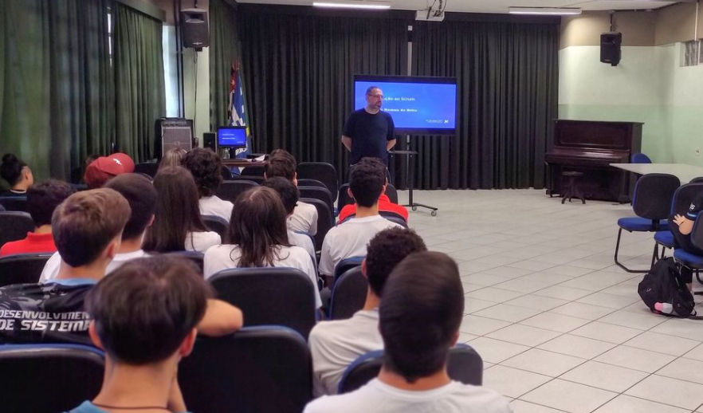

---

## 🎤 Palestra: Criatividade e Inovação: Um Desafio Constante – ITIX
**Data:** 08/04/2024

Nesta palestra, conduzida por Eduardo Von e promovida pela empresa parceira ITIX, nós exploramos a importância da criatividade e da inovação como habilidades essenciais no mercado atual.
Eduardo compartilhou estratégias para desenvolver a criatividade e superar bloqueios comuns, enfatizando como a inovação pode impulsionar tanto o desenvolvimento profissional quanto o sucesso de projetos.
A palestra destacou a necessidade de adaptação constante às mudanças do setor de tecnologia.

---

## 🎤 Palestra: As Possibilidades da IA no Mercado de Trabalho – Tegra
**Data:** 23/05/2024

Nesta palestra, Guilherme Bastos, da empresa Tegra, abordou as múltiplas possibilidades que a inteligência artificial traz para o mercado de trabalho.
Ele explorou as aplicações práticas da IA em diferentes setores e discutiu como essa tecnologia pode transformar processos e criar novas oportunidades profissionais.
Depois nós tivemos uma atividade prática: usar ferramentas de Inteligência Artificial para construir um currículo, usamos o Chat GPT para gerar o conteúdo e o Gama App para criar o layout.
A atividade nos mostrou como funciona a engenharia de prompt e como ela influencia nos resultados gerados pela IA.

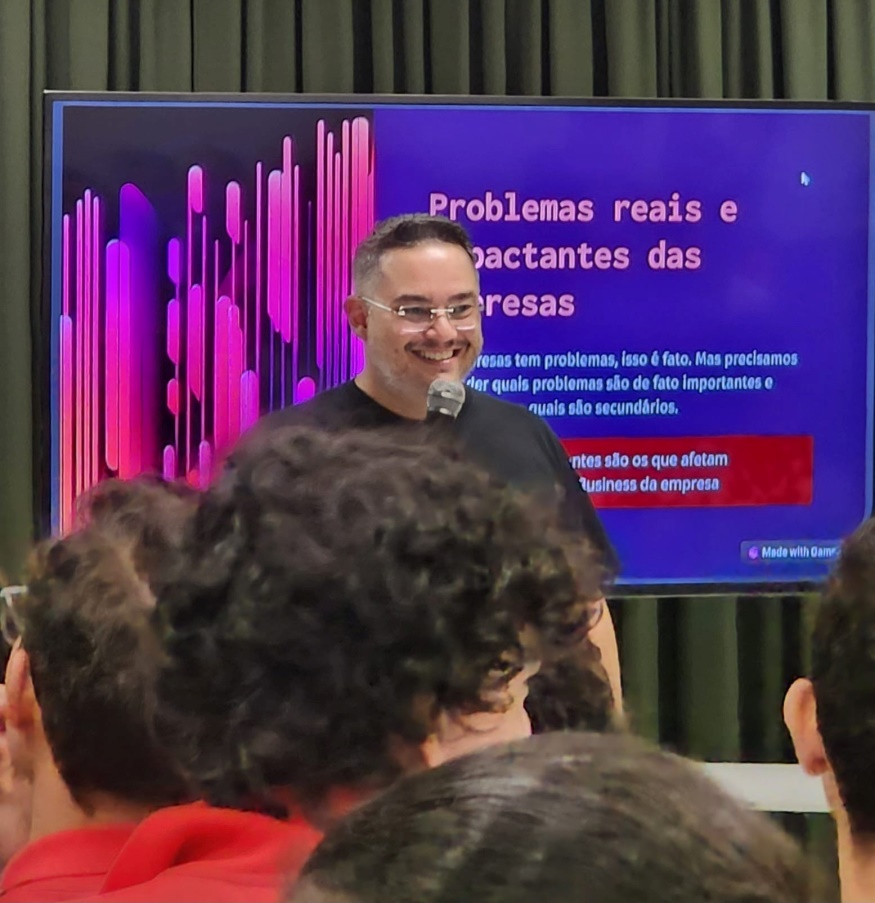

---

## 💻 Palestra Remota: Liderança e Gestão 3.0 – Eduzz
**Data:** 27/05/2024

Nesta palestra remota conduzida por Victor Palencia e Débora de Andrade, foram abordados conceitos modernos de liderança e gestão, enfatizando a importância de modelos ágeis e adaptativos.
Eles discutiram a evolução do conceito de Mundo VUCA (Volatilidade, Incerteza, Complexidade e Ambiguidade) para o conceito de Mundo BANI (Brittle, Anxious, Nonlinear, Incomprehensible), refletindo as mudanças e desafios atuais enfrentados pelas organizações.
Os palestrantes destacaram a Gestão 3.0, um modelo que promove a autonomia, a colaboração e a motivação, onde equipes têm liberdade para tomar decisões e contribuir ativamente para o sucesso organizacional, criando uma cultura saudável e inovadora.

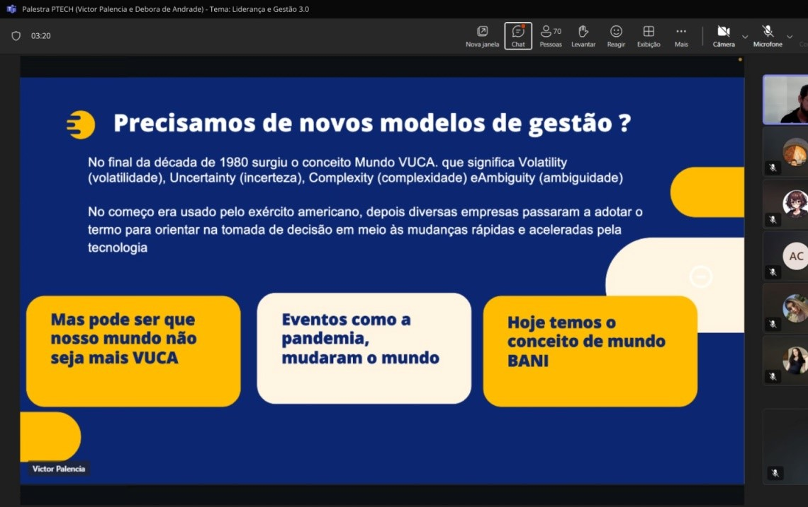

---

## 🎤 Bate-Papo com Estagiários da ITIX
**Data:** 18/06/2024

Neste encontro, nós participamos de um bate-papo com estagiários da empresa parceira ITIX, que compartilharam suas experiências, desafios e aprendizados durante o estágio.
Os estagiários discutiram as habilidades que adquiriram e como têm aplicado o conhecimento teórico na prática.
A conversa permitiu que nós obtivéssemos uma visão realista sobre o início da carreira em TI, além de dicas valiosas para se destacar nos primeiros passos profissionais.

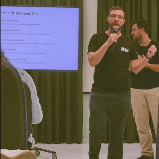

---

## 🎤 Palestra: Explorando Homelabs – Por que Criar seu Próprio Ambiente de Desenvolvimento Pode Transformar sua Carreira em TI – ITIX
**Data:** 18/06/2024

Na palestra conduzida por Edmilson, foi explorado o conceito de homelabs como uma forma eficaz de impulsionar o aprendizado e o desenvolvimento em tecnologia.
Edmilson discutiu os benefícios de configurar um ambiente de desenvolvimento próprio, destacando como essa prática permite o estudo aprofundado de novas tecnologias, simulação de problemas reais e ganho de experiência prática. No fim, fomos questionados sobre os conceitos abordados durante a palestra.

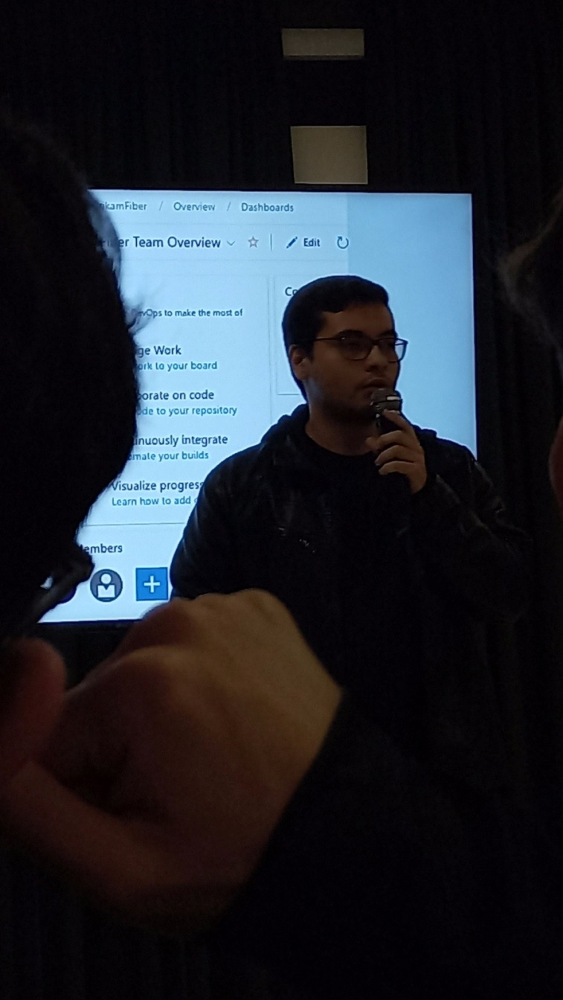

---

## 💻 Palestra Remota: Hacker do Bem e Segurança Digital no Dia a Dia – Eduzz
**Data:** 31/07/2024

Nessa palestra remota, Luiz Fernando Milagres, da empresa Eduzz, abordou o papel do “hacker do bem” e a importância da segurança digital no cotidiano.
Luiz explicou como os profissionais de segurança trabalham para proteger sistemas e dados, e destacou as práticas essenciais para fortalecer a segurança digital tanto em ambientes profissionais quanto pessoais.

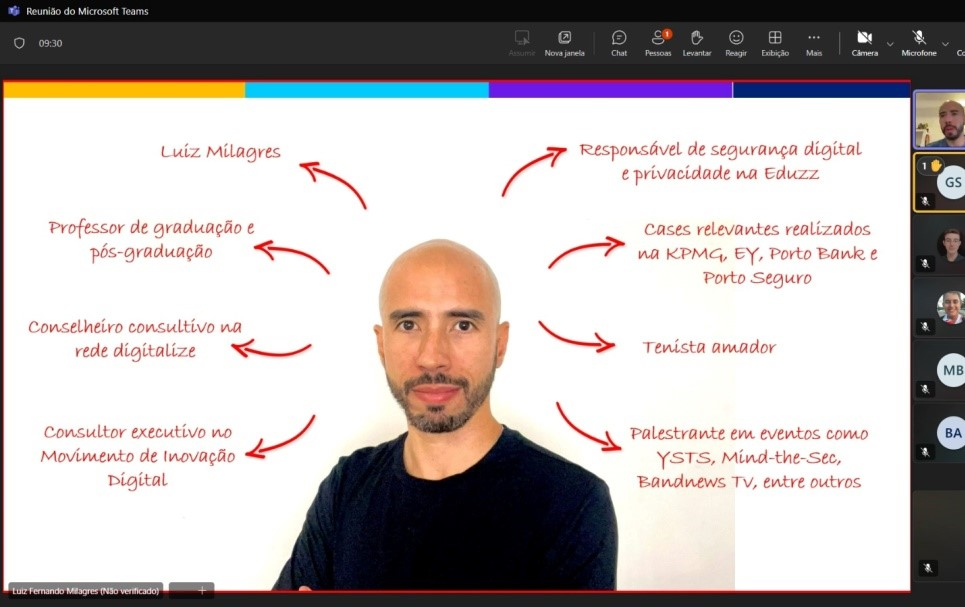
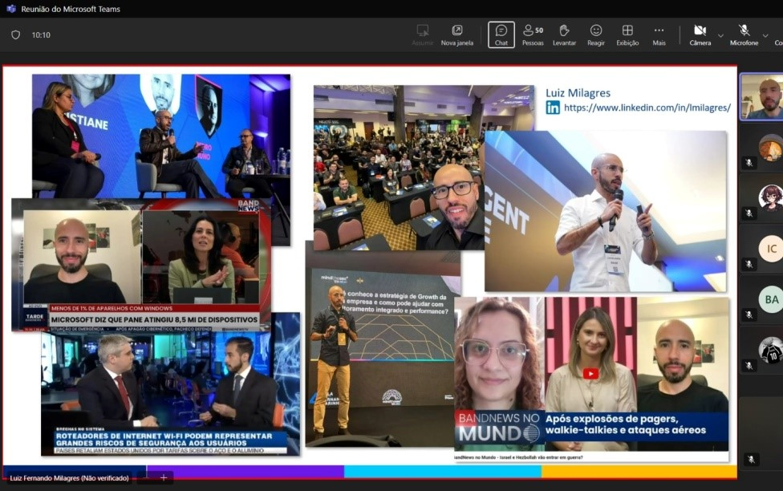

---

## 💻 Palestra Remota: Você é uma Pessoa Organizada? – Eduzz
**Data:** 28/08/2024

Nesta palestra remota, conduzida por Vinicius Lima e Michele Ambrosio da Eduzz, nós refletimos sobre a importância da organização pessoal e profissional.
Os palestrantes discutiram métodos e estratégias para melhorar a gestão do tempo, definir prioridades e alcançar metas com mais eficiência.
Eles organizaram uma atividade prática, na qual nós escrevíamos uma série de símbolos em duas ordens especificas e comparávamos o tempo que levou em cada uma, o que nos fez perceber como a forma realização de um trabalho afeta a eficiência.

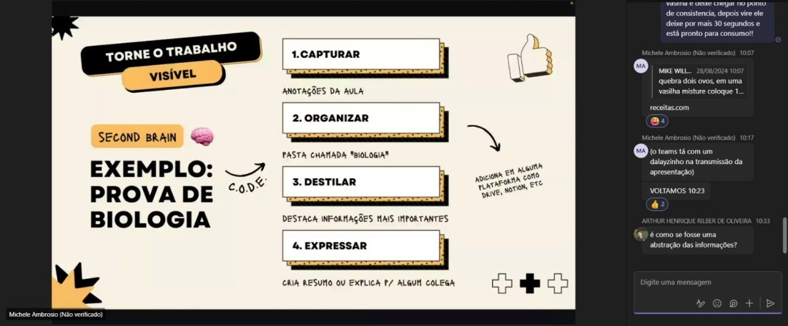
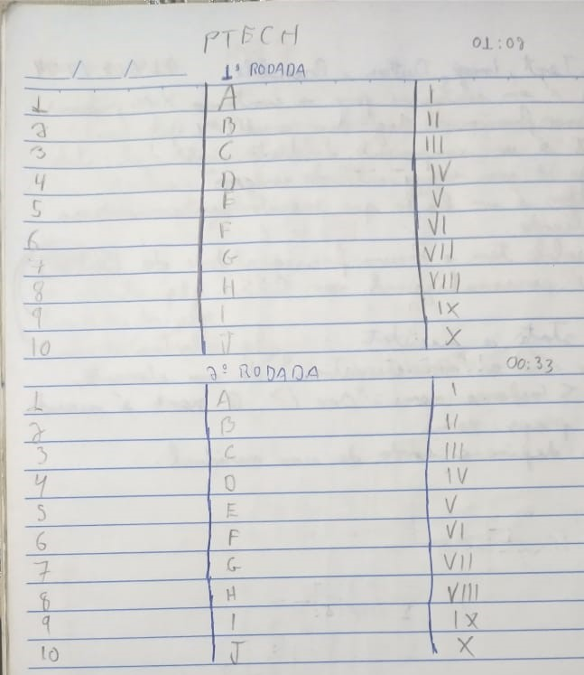

---

## 💻 Palestra Remota: Fluxo de Operações Comercial – Uno ERP
**Data:** 29/08/2024

Nesta palestra remota, André Lopes e Tamiris Marciano, da empresa Uno, apresentaram o fluxo de operações comerciais utilizando o sistema Uno ERP.
Os palestrantes explicaram como o ERP otimiza processos empresariais, desde o gerenciamento de vendas e estoques até o atendimento ao cliente.
A palestra destacou as funcionalidades essenciais do sistema e demonstrou como uma solução integrada pode trazer mais eficiência e controle às operações comerciais, nos proporcionando uma visão prática sobre o uso de ERPs no mercado.

---

## 🎤 Palestra: Tendências da Área de TI com a Virada da IA Generativa e Outras Tecnologias – Tegra
**Data:** 05/09/2024

Nesta palestra presencial, Guilherme Bastos, da empresa Tegra, explorou as principais tendências da área de TI, com foco no impacto das tecnologias emergentes, como a IA Generativa.
Guilherme discutiu como essas inovações estão transformando o mercado e criando novas oportunidades para profissionais da área.
A palestra abordou o potencial da IA e outras tecnologias avançadas para impulsionar a automação, otimização de processos e criação de soluções inovadoras, nos proporcionando uma perspectiva sobre o futuro da tecnologia e as habilidades que serão valorizadas.

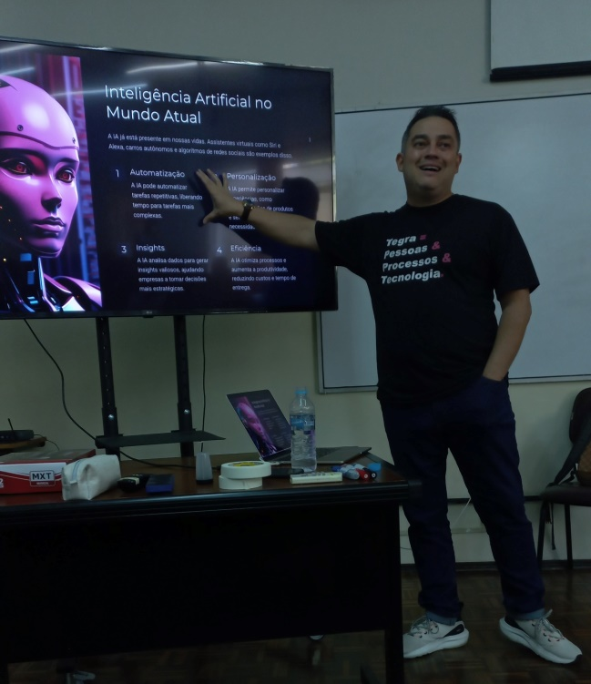

---

## 💻 Palestra Remota: Capricho – Skill Cada Vez Mais Raro no Mercado – Eduzz
**Data:** 24/09/2024

Nessa palestra remota, Luiz Fernando Milagres, da Eduzz, falou sobre a importância do capricho e da atenção aos detalhes como habilidades diferenciais no mercado de trabalho.
Luiz discutiu como essa competência, muitas vezes subestimada, contribui para a qualidade dos projetos e a satisfação dos clientes.
A palestra nos incentivou a desenvolver um cuidado extra em suas atividades, destacando que o capricho, aliado às habilidades técnicas, é um diferencial cada vez mais valorizado pelos empregadores.

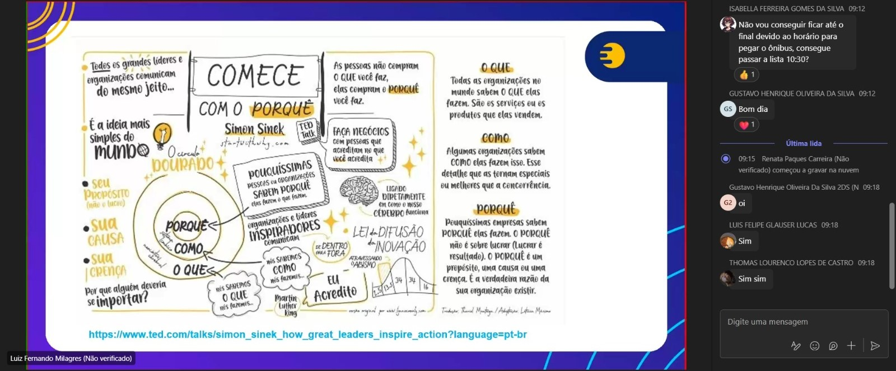

---

## 🎤 Palestra: Desenvolvimento Low Code – Tegra
**Data:** 10/10/2024

Nesta palestra presencial, Guilherme Bastos, da empresa Tegra, apresentou as diferenças entre desenvolvimento Low Code e No Code.
Guilherme explicou as vantagens de cada abordagem, que permitem a criação de aplicações com pouca ou nenhuma necessidade de programação avançada, tornando o desenvolvimento mais acessível e ágil.
A palestra incluiu exemplos práticos do uso de plataformas Low Code no mercado, como o FlutterFlow, e nos incentivou a explorar essa metodologia como uma alternativa eficiente para o desenvolvimento de projetos.
Ao final, respondemos um formulário com questões sobre o conteúdo da palestra.

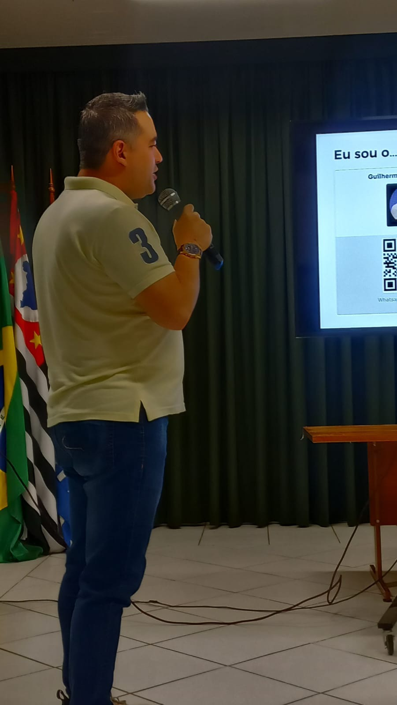
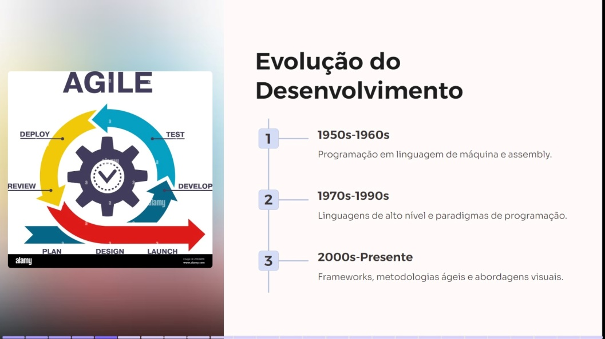

---

## 🔴 Live: Preparando-se para o Amanhã – Da ETEC/FATEC para o Mundo – Fundação Iochpe
**Data:** 17/10/2024

Nesta live no YouTube, promovida pela Fundação Iochpe, a palestrante Flávia Freitas discutiu a importância da preparação contínua para o mercado de trabalho e como os cursos técnicos da Etec podem abrir portas para a Fatec e além.
Ex-alunos compartilharam suas trajetórias e mostraram como a formação técnica e acadêmica foi essencial para suas carreiras.
A palestra trouxe conselhos práticos para estudantes, destacando a importância do foco, da disposição para aprender e da valorização das oportunidades durante a jornada educacional e profissional.

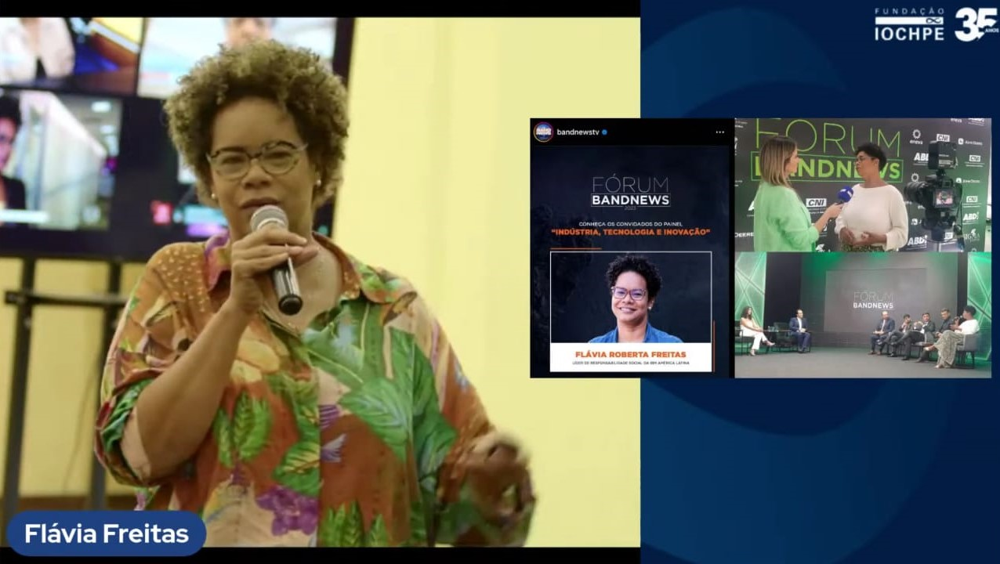
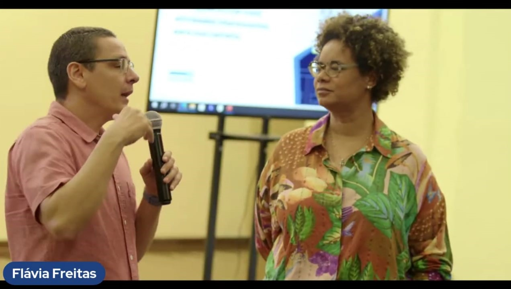
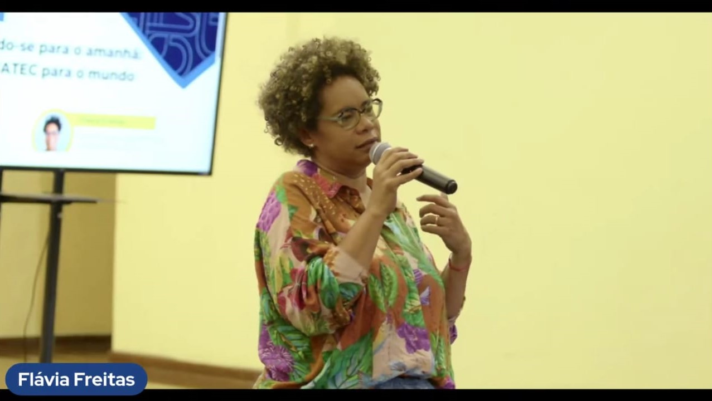

---

## 🔴 Live: A Revolução da Web3 e a Propriedade Digital  
**Data:** 04/11/2024

Esta live, transmitida pelo canal da Fundação Iochpe no YouTube, abordou o tema da **Web3** e seu impacto na **propriedade digital**. O palestrante, **Caio Matos**, destacou como a tecnologia blockchain está transformando a forma de lidar com dados, ativos digitais e novas formas de economia descentralizada.  

Durante a apresentação, foram discutidos:  
- Os conceitos centrais da **Web3**;  
- A importância da **propriedade digital** no mundo moderno;  
- Exemplos práticos de aplicações e oportunidades de inovação nesse ecossistema;  
- A relevância dessa transformação para o futuro do mercado de trabalho e para a formação de novas competências digitais.  

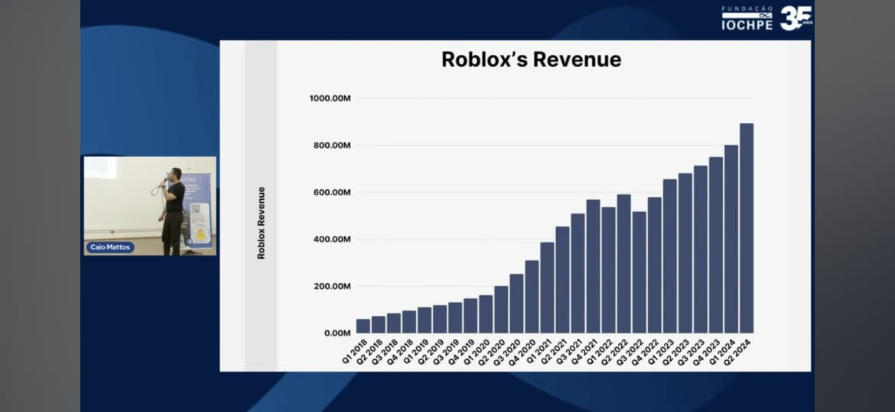
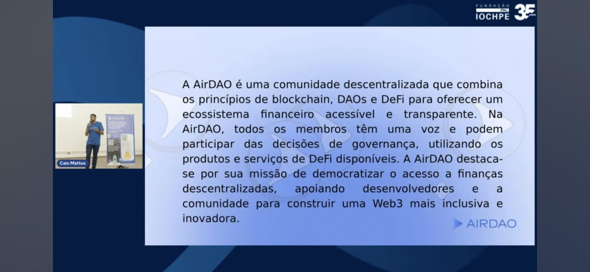
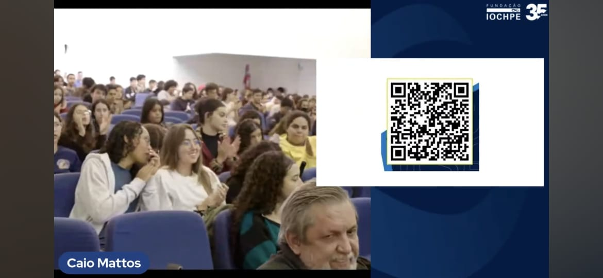

---

## 💻 Palestra Remota: Desafios do primeiro emprego em TI e como superá-los  
**Data:** 10/04/2025

Nessa palestra remota nós fomos introduzidos à realidade da área de TI no mercado de trabalho. Discutimos temas atuais como:
- A influência das IAs sobre o mercado
- Desafios ao encontrar um trabalho
- Como ser reconhecido no mercado (montando um perfil no LinkedIn, criando projetos pessoais no GitHub, etc)
- Como é importante estar sempre atualizado nessa área.

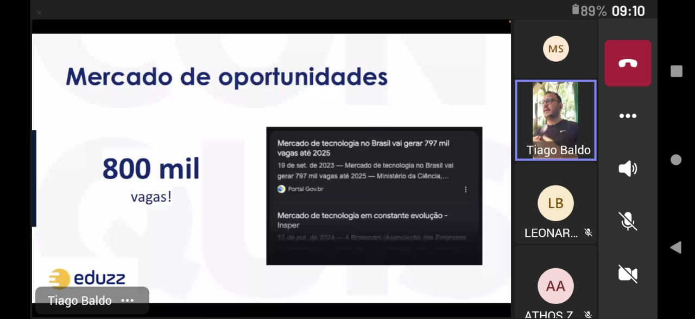
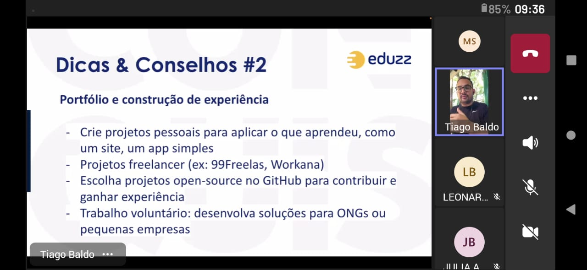
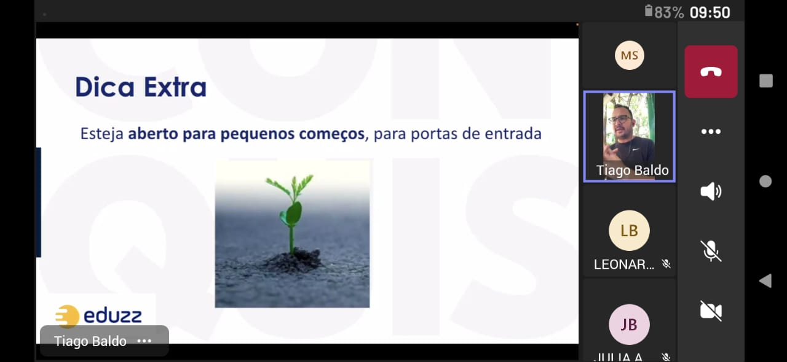

---

## 🎤 Palestra: Bate-papo Tech ITIX -  Carreira e Suporte na Prática  
**Data:** 16/04/2025

Nessa palestra nós discutimos temas como:
- Troca de carreira/inicio de carreira
- Estagiário buscando efetivação
- Utilizando IA no dia a dia do trabalho
- Gestão de Suporte
Aprendemos sobre a importância da boa comunicação entre os setores que trabalham em algum projeto, ao final foi feita uma dinâmica em que nos separamos em grupos, cada grupo foi separado em dois setores: o setor de desenvolvimento e o de suporte.
Um problema foi apresentado a nós, os analistas de suporte deveriam descobrir a causa do problema e então comunicar os desenvolvedores, que tinham que descobrir a solução.

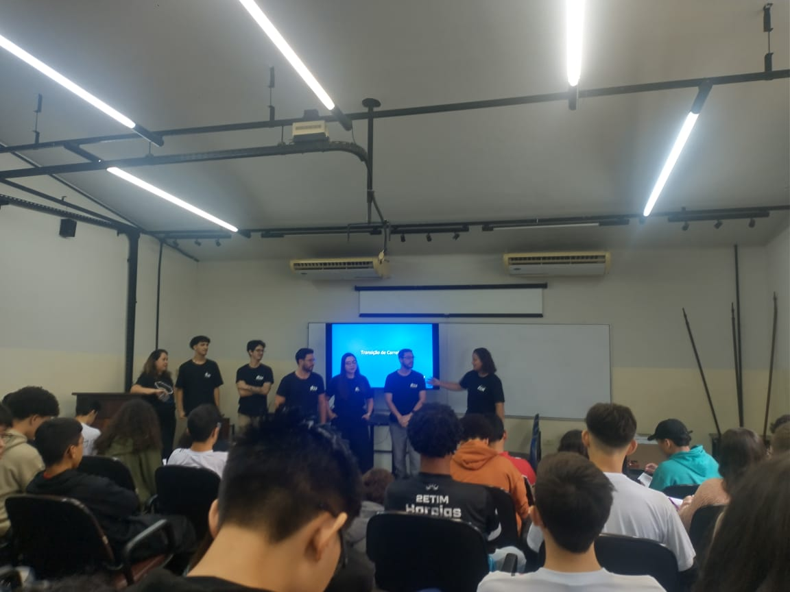
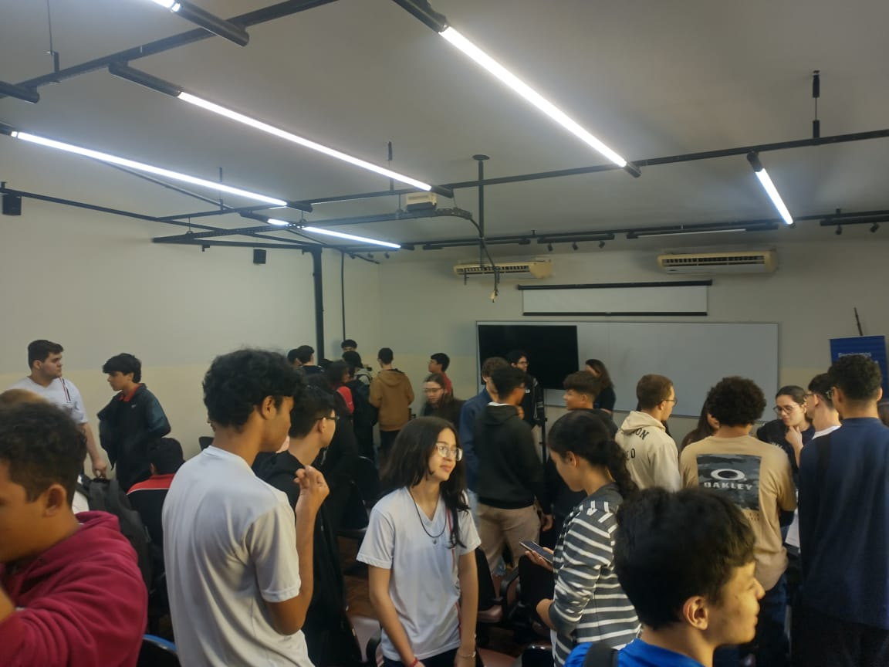

---

## 💻 Palestra Remota: LinkedIn e Marca Pessoal para Profissionais de TI  
**Data:** 23/04/2025

O objetivo da palestra foi nos orientar sobre como utilizar o LinkedIn de forma estratégica para fortalecer nossa marca pessoal e ampliar oportunidades de networking.

Durante a apresentação, foram discutidos:  
- Definição e importância da **marca pessoal**
- Construção de uma imagem profissional sólida
- Recomendações para **foto de perfil** e **título**
- Estratégias para otimizar o perfil e destacar habilidades
- A importância de interagir na rede por meio de posts, comentários e conexões

Essa atividade reforçou a relevância de se posicionar de maneira estratégica em ambientes digitais, ampliando a visibilidade profissional e preparando para futuras oportunidades no mercado de trabalho.

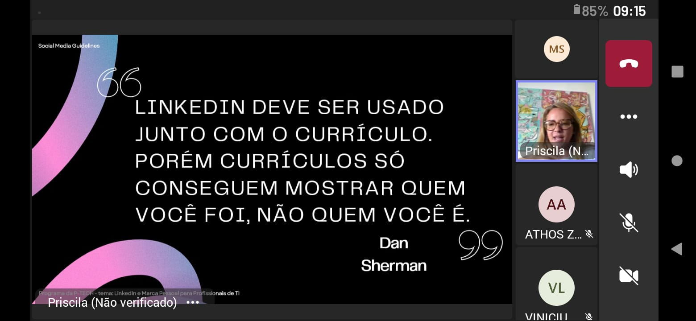
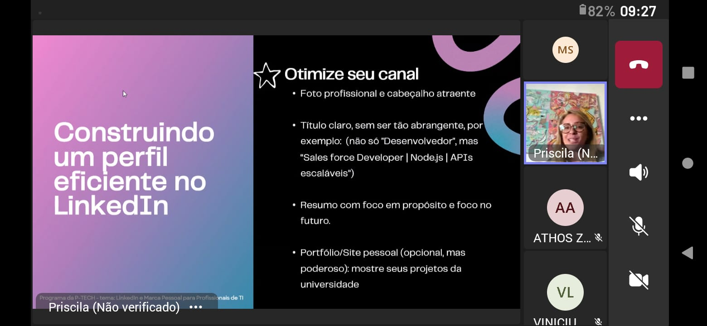

---

## 💻 Palestra Remota: Empreendedorismo e Inovação na Tecnologia  
**Data:** 13/05/2025

O objetivo da palestra foi discutir os desafios e oportunidades de **empreender na área de Tecnologia da Informação**, apresentando **cases de startups** e exemplos de inovação tecnológica.

A palestrante, **Luciana Ogusco**, compartilhou suas experiências pessoais no setor, destacando tanto os erros quanto os acertos ao longo de sua trajetória profissional.
A partir disso, forneceu conselhos práticos e reflexões sobre:
- Como identificar oportunidades de inovação
- Os principais desafios de uma startup
- A importância de aprender com falhas e persistir no processo empreendedor
- O impacto da inovação tecnológica no mercado atual e futuro.

Essa atividade foi fundamental para compreender melhor o cenário do **empreendedorismo em TI**, reforçando a importância da resiliência, da criatividade e da adaptação como competências essenciais para profissionais da área.

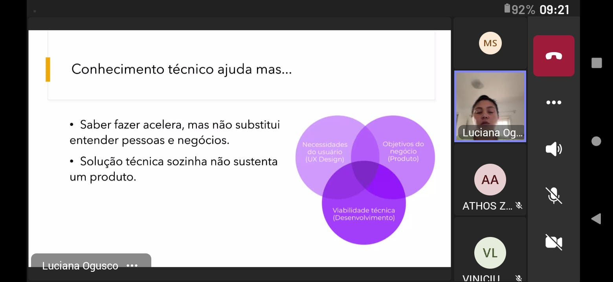
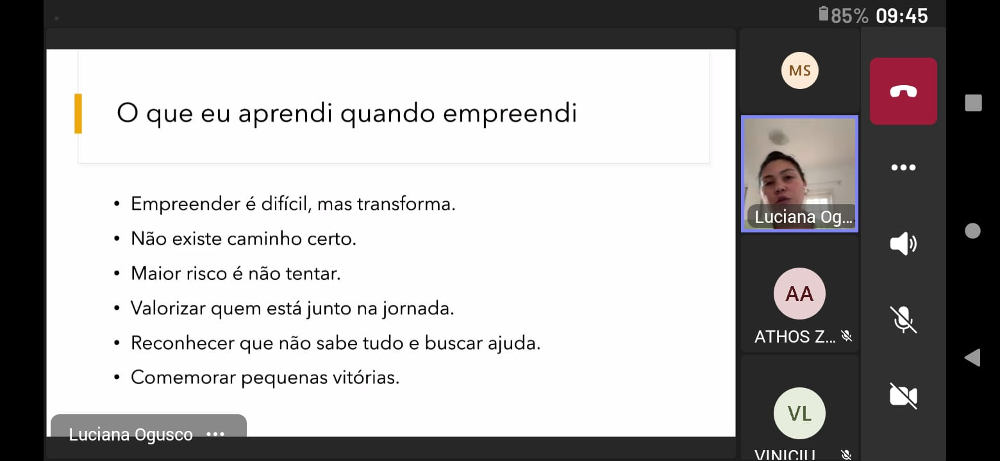

---

## 💻 Palestra Remota: Produtividade e Organização no Dia a Dia  
**Data:** 20/08/2025

O objetivo da palestra foi apresentar ferramentas e estratégias para melhorar a **produtividade** e a **organização** no dia a dia, tanto no ambiente **remoto** quanto no **presencial**.

Durante a apresentação, a palestrante abordou:
- Técnicas de organização aplicáveis ao cotidiano
- Métodos de **gestão de tempo**
- Boas práticas para equilibrar tarefas profissionais e pessoais
- A utilização da **Matriz de Eisenhower** para definir prioridades
- Outras técnicas complementares de planejamento e foco

A atividade contribuiu para reforçar a importância da **autogestão** e da adoção de ferramentas práticas para aumentar a eficiência e reduzir o estresse no ambiente de trabalho.

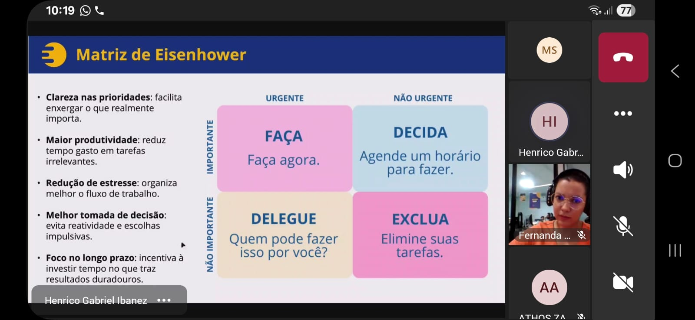

---

## 📝 Treinamento Presencial: Banco de Dados  
**Data:** 27/08/2025

Nesse treinamento nós aprendemos conceitos relacionados aos Bancos de Dados.
Foram apresentados alguns conceitos básicos como:
- SGBDRs (Sistemas de Gerenciamento de Banco de Dados Relacional)
- Tabelas
- Chave Primária e Estrangeira

E também alguns conceitos mais avançados:
- Funções
- Stored Procedures
- Triggers

Após a palestra, nós fomos aos laboratórios e realizamos algumas atividades relacionadas ao assunto, executando inserts, selects e outros comandos do SQL.

---

## 📝 Treinamento Presencial: Banco de Dados  
**Data:** 03/09/2025

O objetivo da palestra foi conscientizar sobre a importância da **Segurança da Informação** e apresentar medidas práticas para proteção de dados pessoais e corporativos.

Durante a apresentação, o palestrante abordou:
- O conceito de **MFA (Multi-Factor Authentication)** como camada adicional de segurança
- A criação de **senhas fortes e seguras**
- Técnicas de **phishing** e como identificá-las
- Outras práticas essenciais para reduzir riscos de ataques cibernéticos

A atividade ressaltou a relevância da **cibersegurança** no cotidiano e no ambiente profissional, destacando como pequenas mudanças de hábito podem contribuir para uma maior proteção de informações sensíveis.

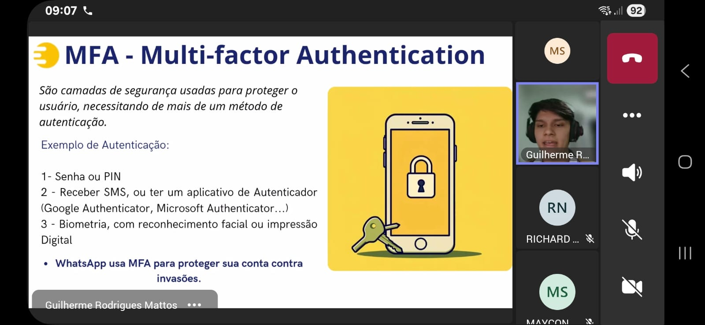

---

## ✍️ Autor
**Murilo Reis Schiavotto**
Portfólio acadêmico de atividades extracurriculares.
